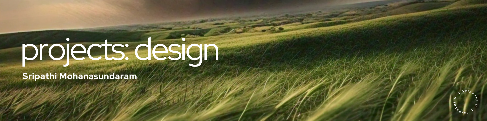

# Design Portfolio
   

## Overview
Welcome to my design portfolio, a curated collection showcasing innovative projects across UX/UI design, branding, marketing, and graphic design. This repository highlights my commitment to blending user-centered design principles with visually compelling aesthetics and strategic marketing insights to enhance user experience and brand perception.

## Project Showcase
Explore a diverse array of projects, each reflecting my passion for creating impactful and memorable design solutions.

- **Project 1: [Newsletter Design for GenAI Campaign](https://github.com/microize/Projects_Design/tree/main/01.newsletter_template_design_genai_campaign)**
  - Designed a dynamic and interactive weekly newsletter aimed at engaging and educating audiences about Generative AI. The design focuses on fostering curiosity and understanding of this cutting-edge technology.

## About
Dive into each project to see how I integrate design thinking with strategic insights to create solutions that not only look great but also achieve business goals. This repository represents more than just finished products—it's a reflection of my design philosophy and my dedication to crafting exceptional user experiences.

## Usage
Feel free to explore the projects, review the methodologies, and delve into the design processes. Whether you’re a fellow designer, a potential client, or simply interested in design, you’ll find valuable insights and inspiration here. If you find the work here inspiring or valuable, I’d be thrilled if you could star the repository!

## Contact
For collaboration inquiries, feedback, or to discuss potential projects, please reach out to me via email at [3sripathi@gmail.com](mailto:3sripathi@gmail.com). Additionally, you can explore more of my in-depth analyses and observations on machine learning on my [Medium blog](https://medium.com/@3sripathi) or connect with me on [LinkedIn](https://www.linkedin.com/in/sripathi-mohanasundaram/).

Discover the creative potential through this portfolio, where each project showcases my dedication to enhancing user experience and elevating brand identity. Dive in to see how thoughtful design can make a difference.
